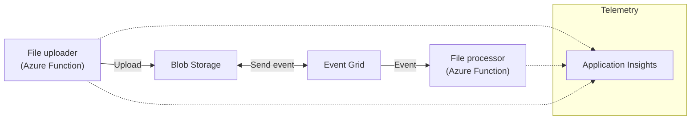

# Azure Event Grid e2e tracing

## What is this?

This prototype/sample solves the issue of missing end-to-end tracing when using .NET, Application Insights and Azure Event Grid to asynchonously process blob uploads.



The goal is to be able to go to Application Insights and see the upload operation, the Event Grid message and the processing operation in one sequence end-to-end.

Unfortunately, in this setup the Event Grid event generated by Azure Storage when blob is uploaded doesn't contain tracing information, which could tie it back to the original upload operation.

Let's explore the options in more detail. Event Grid supports two types of schemas: *Event Grid schema* and *Cloud Events 1.0 schema*.

### Event Grid schema

Main benefit of using this schema when configuring a topic is the ability to use the `EventGridTrigger` trigger in Azure Functions which automatically handles receiving an event and parsing it.

> This trigger cannot be used when the EG topic is configured with Cloud Event schema for reasons explained below.

❌ The downside is that Event Grid Event doesn't contain `extendedProperties` which would be populated with the right `traceparent` of the upload operation.

❌ `clientRequestId`, `requestId` or `storageDiagnostics` on the incoming event don't correlate with any of the upload request IDs.

### Cloud Event schema

Cloud Event schema is better equipped for tracing, because is contains Extended Properties into which client applications put a `traceparent` field to indicate its parent operation (file upload in our case).

❌ Unfortunately, Azure Storage doesn't set `traceparent` and `tracestate` when sending Cloud Schema event after a blob is uploaded using `BlockBlobClient`. (➡️ `Uploader.cs` -> `Uploader`)

What if we don't rely on Azure Storage and create our **own event** with the Event Grid SDK? In this case the Application Insights integration kicks in nicely and the `traceparent` extended property is populated properly. (➡️ `Uploader.cs`/ -> `UploaderCustom`) But then the receiving end **doesn't read it automatically** and manual linking has to be done in Function code. (➡️ `UploaderProcessor.cs` -> `UploadProcessorHttp`)

Additionally, when using Cloud Events with Azure Functions, the Event Grid binding doesn't natively support this schema, so HTTP trigger must be used and the Cloud Event handshake needs to be handled in Function code. ([Documentation](https://docs.microsoft.com/azure/event-grid/cloudevents-schema#use-with-azure-functions))

```csharp
if (req.Method == HttpMethod.Options)
{
    var response = req.CreateResponse(HttpStatusCode.OK);
    response.Headers.Add("Webhook-Allowed-Origin", "eventgrid.azure.net");

    return response;
}
```

## The solution

End-to-end tracing for Storage Uploads can be done by manually linking the incoming Event Grid event with the current telemetry context. There's a blogpost on Microsoft Devblogs which was the key inspiration for this solution. Go check it out for broader context: https://devblogs.microsoft.com/azure-sdk/distributed-tracing-with-azure-functions-event-grid-triggers/

There are two approaches:

1. Store the tracing information (operation ID) as metadata on the uploaded blob, read it on the receiving end and update telemetry link.
1. Send custom Event Grid event which contains the right `traceparent` value, parse it on the receiving end and update telemetry link.

### Blob metadata

See `Uploader` in `Uploader.cs`:

```csharp
// upload the blob first
await blobClient.UploadAsync(path);

// read tracing information from the current context
var metadata = new Dictionary<string, string>()
{
    { "traceid", Activity.Current.Context.TraceId.ToString() },
    { "spanid", Activity.Current.Context.SpanId.ToString() },
    { "tracestate", Activity.Current.Context.TraceState }
};

// set metadata on the uploaded blob
blobClient.SetMetadata(metadata);
```

And then `UploadProcessor` in `UploadProcessor.cs`:

```csharp
// read metadata from the blob
var properties = input.GetProperties();
var metadata = properties.Value.Metadata;

// expecting to find trace ID and span ID as separate values (for easier processing)
if (metadata.ContainsKey("traceid") && metadata.ContainsKey("spanid"))
{
    // link this activity to the upload operation
    Activity.Current.AddTag("_MS.links", JsonSerializer.Serialize(new[] { new AzureMonitorLink(metadata["traceid"], metadata["spanid"]) }));
}
```

This approach can get problematic under heavy load, because it needs to do two calls for each upload (the upload itself and set metadata).

### Custom event

See `UploaderCustom` in `Uploader.cs`:

```csharp
var resp = await blobClient.UploadAsync(path);

var eventGridClient = new EventGridPublisherClient(
    new Uri(System.Environment.GetEnvironmentVariable("EventGridEndpoint")), 
    new AzureKeyCredential(System.Environment.GetEnvironmentVariable("EventSenderGridKey")));

var @event = new EventGridEvent("fileUploader", "Custom.Storage.BlobCreated", "1.0", new BlockBlobEventData()
{
    // these properties are not required, just simulating the actual blob event
    api = "PutBlockList",
    contentType = "application/octet-stream",
    blobType = "BlockBlob",
    url = blobClient.Uri.AbsoluteUri,
    clientRequestId = Activity.Current.Context.TraceId.ToString(),
    requestId = Activity.Current.Context.SpanId.ToString()
});
await eventGridClient.SendEventAsync(@event);
```

And then `UploadProcessorHttp` in `UploadProcessor.cs`:

```csharp
var requestmessage = await req.Content.ReadAsStringAsync();
var cloudEvent = CloudEvent.Parse(BinaryData.FromString(requestmessage));

// parse tracing information from the event
if (cloudEvent.ExtensionAttributes.TryGetValue("traceparent", out var tp) && tp is string traceparent)
{
    var traceId = traceparent.Substring(3, 32); // traceId
    var spanId = traceparent.Substring(36, 16); // spanId

    Activity.Current.AddTag("_MS.links", JsonSerializer.Serialize(new[] { new AzureMonitorLink(traceId, spanId) }));
}
```

### Link telemetry

Either way, the crucial part is to link the trace ID to current context:

```csharp
private readonly record struct AzureMonitorLink(string operation_Id, string id); // field names must be exactly this

Activity.Current.AddTag("_MS.links", JsonSerializer.Serialize(new[] { new AzureMonitorLink(traceId, spanId) }));
```

## Contents

```
Functions:

        Uploader: [GET] http://localhost:7071/api/Uploader

        UploaderCustom: [GET] http://localhost:7071/api/UploaderCustom

        UploadProcessorHttp: [POST,OPTIONS] http://localhost:7071/api/UploadProcessorHttp

        UploadProcessor: eventGridTrigger
```

Calling any of the Uploader endpoints (simple HTTP GET) will upload a file to the Storage Account and one or both of the Processors will receive it.

## Configuration

These configuration values are expected:

```json
{
  "IsEncrypted": false,
  "Values": {
    "AzureWebJobsStorage": "",
    "FUNCTIONS_WORKER_RUNTIME": "dotnet",
    "APPINSIGHTS_INSTRUMENTATIONKEY": "",
    "TargetStorageConnectionString": "",
    "ServiceBusOutputConnectionString": "",
    "EventGridEndpoint": "",
    "EventSenderGridKey": ""
  }
}
```

Setting up the full Event Grid integration is not in scope of this README. Check the Event Grid documentation to see how the integration is configured.

* Storage Blob Event Overview: https://docs.microsoft.com/en-us/azure/storage/blobs/storage-blob-event-overview
* Azure Blob Storage as an Event Grid source: https://docs.microsoft.com/en-us/azure/event-grid/event-schema-blob-storage?tabs=event-grid-event-schema
* Tutorial: Automate resizing uploaded images using Event Grid: https://docs.microsoft.com/en-us/azure/event-grid/resize-images-on-storage-blob-upload-event?tabs=dotnet%2Cazure-powershell
* Azure Event Grid trigger for Azure Functions: https://docs.microsoft.com/en-us/azure/azure-functions/functions-bindings-event-grid-trigger?tabs=in-process%2Cextensionv3&pivots=programming-language-csharp